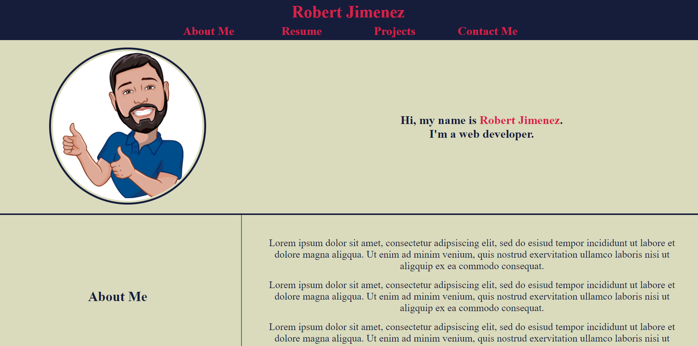
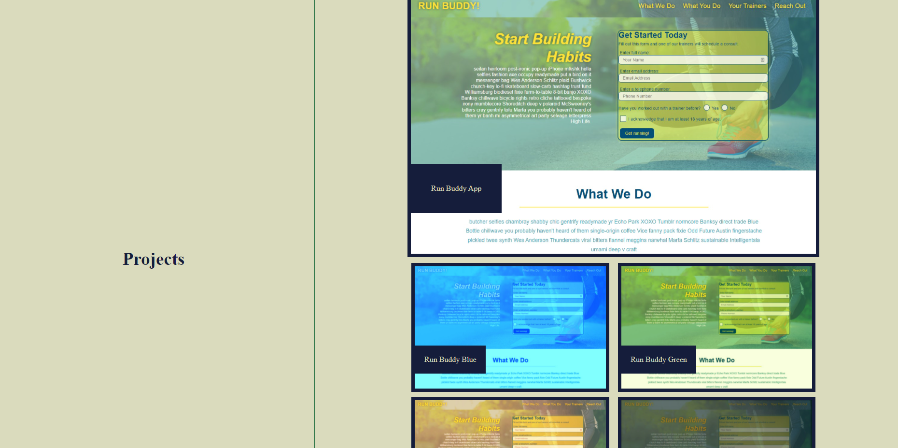

# Portfolio | Robert Jimenez

## Description 

This project was a working, deployed, professional portfolio. It will updated routinely, so check back for so you don't miss anything.

**Images of the project:**

Header and About Me Sections

Projects Section

**Link to deployed project:**
https://rjimeneztech.github.io/Robert-Jimenez-Porftolio/

## Table of Contents

This README is for a personal portfolio, so I don't elaborate on this too much.

* [Usage](#usage)
* [Credits](#credits)
* [License](#license)

## Usage

For employers, collaborators, and those interested in my work, please view this portfolio with curiosity and kindness. The current state of this portfolio repeats project thumbnails to fill in space. Although those thumbnails are all functioning links, they all deploy to the same deployed project. In the future, they will be updated with additional exciting projects.

## Credits

Thanks to the instructors at the Rice Full-Stack Web Development, BootCampSpot, and Career Services at 2U. 

## License

[MIT](LICENSE)
---

### Badges

            

For info on where I retrieved these cool badges, check out [shields.io](https://shields.io/).

### Features

This projet doesn't have any special features. 

### Contributing 

There is no need to contribute to this project at this time. Please do not request to contribute to the project.

--- 
